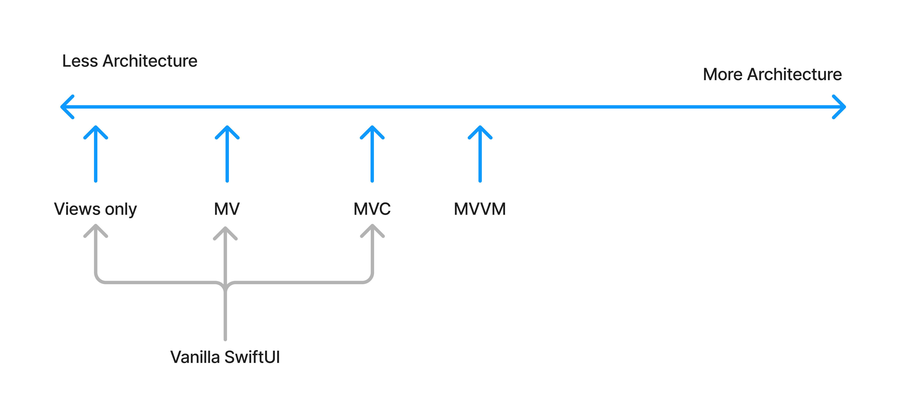
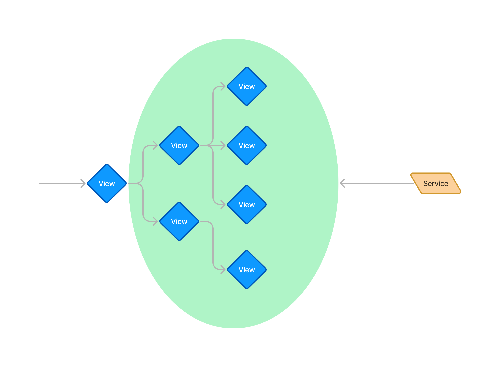
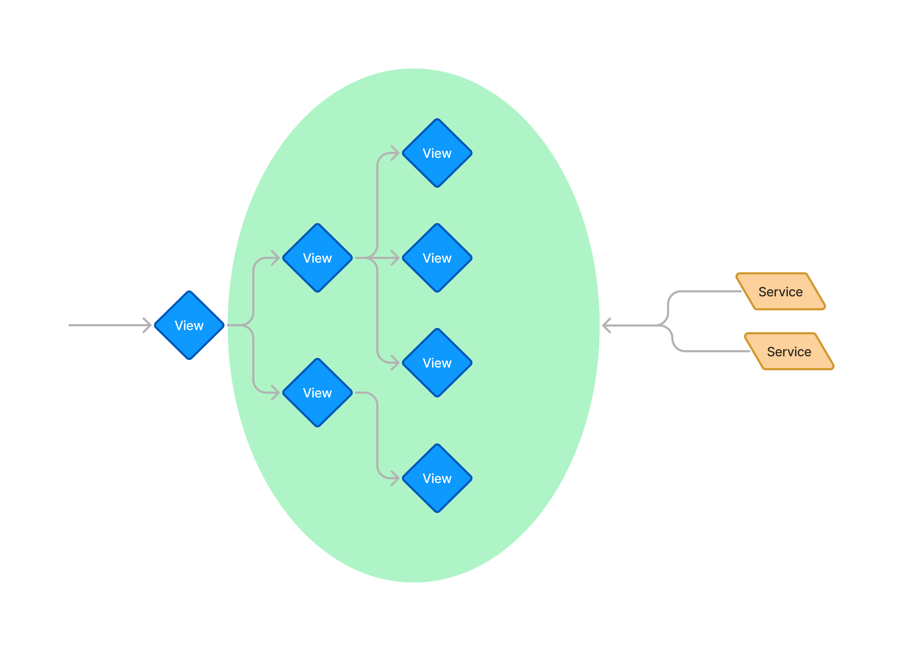
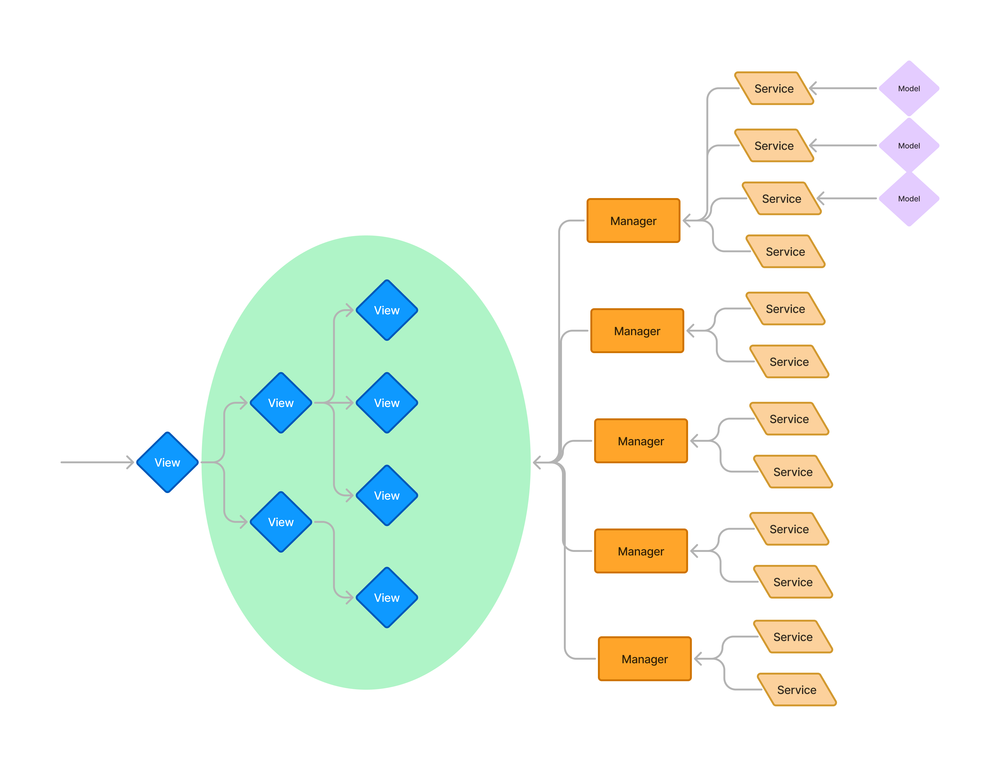
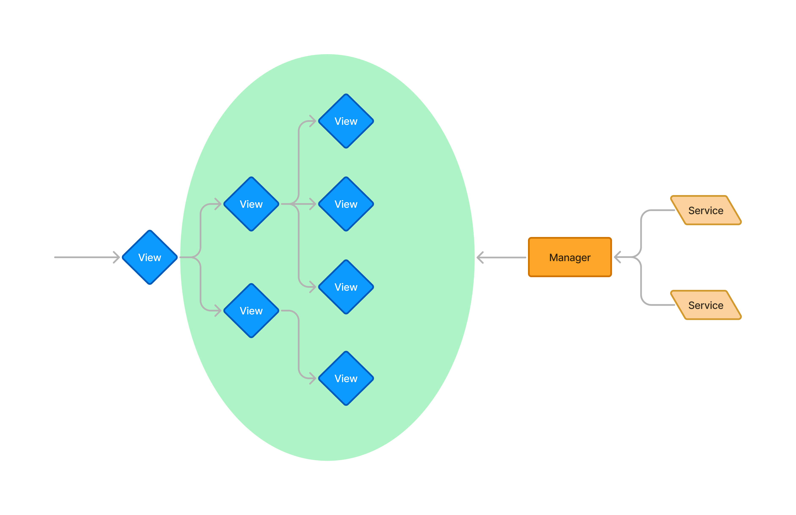
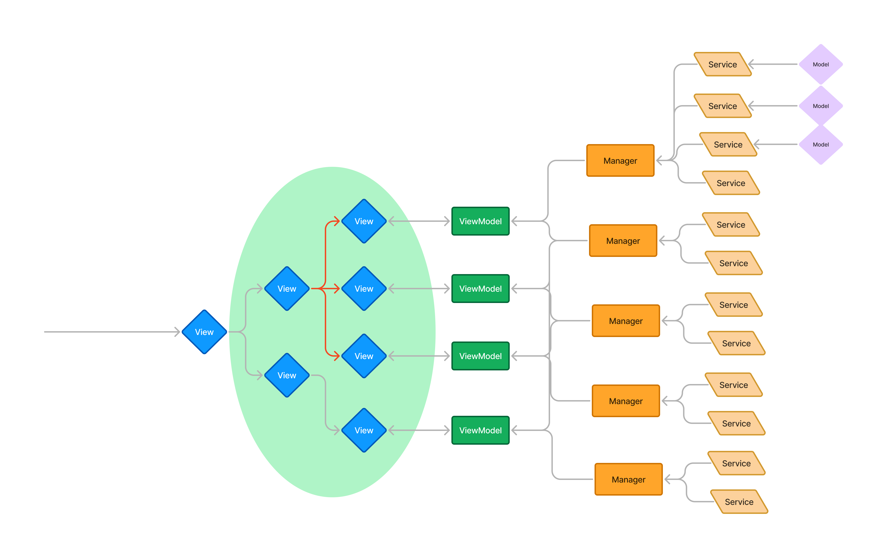
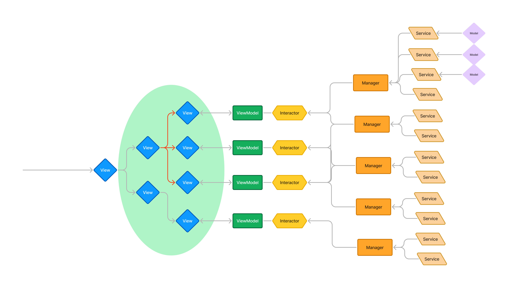
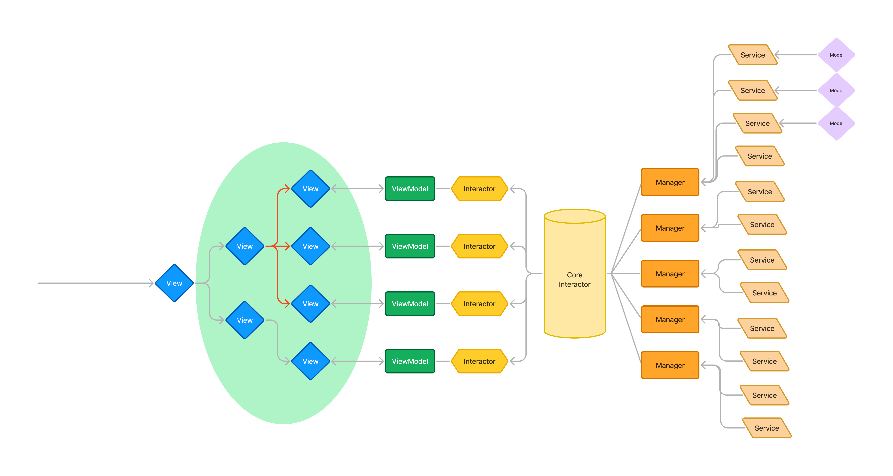
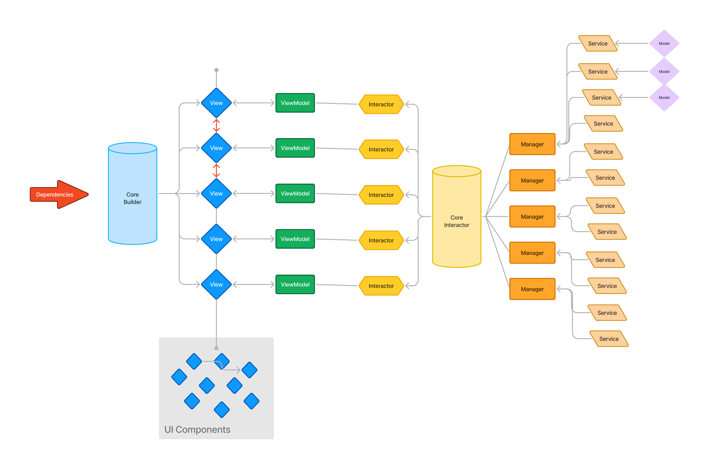
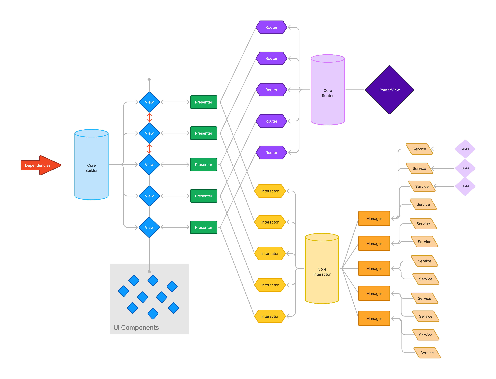

# Architecture in SwiftUI

This is a learning project that shows how a SwiftUI feature can grow from a simple View into a VIPER-style feature.

The goal is not to prove that one architecture is always best. The goal is to understand what changes when an app becomes larger:

- Where does the screen data live?
- Who owns business logic?
- Who talks to the service or database?
- Who creates dependencies?
- Who controls navigation?

Each step adds a boundary when the previous step becomes difficult to test, reuse, or change. More architecture gives more separation, but it also gives more types and more setup. Use the smallest structure that keeps the feature understandable.

## How to read the diagrams

The diagrams are ordered by the learning notes in `ContentView.swift`.

`00` is an overview of the first four ideas. `01` is step 1. `02` is not a separate architecture step; it shows the scaling problem that motivates MV. `03` is step 2, `04` is step 3, and so on.



## The architecture progression

### 1. No architecture: the View owns everything

<table>
<tr>
<td width="50%" valign="top">

<p><strong>Step 1:</strong> One View calls one Service.</p>
</td>
<td width="50%" valign="top">

<p><strong>Transition:</strong> Many Views call Services directly as the app grows.</p>
</td>
</tr>
</table>

This is the simplest SwiftUI screen. The View owns the product array, starts the request, performs the business decisions, and calls the service.

```text
View
 ├── owns products
 ├── owns business logic
 └── calls Service
```

**Pros**

- Simplest code.
- Quick to set up.
- Fewer moving parts and fewer wiring mistakes.

**Cons**

- The View mixes UI, business logic, and data access.
- The logic is difficult to test without creating the View.
- The same work is easy to duplicate in another View.

For a small or temporary screen, this can be a perfectly reasonable starting point.

### The problem before MV: many Views call Services directly

This image is a transition, not a new architecture in the notes. As the app grows, many Views can start calling several Services directly. The View hierarchy becomes larger, and service dependencies spread throughout the app.

This is the pressure that leads to the next step: move shared work into a Manager.

### 2. MV: add a shared Manager

<table>
<tr>
<td width="50%" valign="top">

<p><strong>Step 2: MV</strong><br>Views use shared Managers.</p>
</td>
<td width="50%" valign="top">

<p><strong>Step 3: MVC</strong><br>Views ask a Manager for data.</p>
</td>
</tr>
</table>

MV means **Model–View**. In this project, the View still owns the product array, but a shared Manager is introduced for reusable application and data work.

```text
View
 ├── owns products
 ├── owns some screen decisions
 └── calls Manager
          └── calls Service
```

**Responsibilities**

- **View:** displays products and still contains some business logic.
- **Manager:** owns shared business and data operations.
- **Service:** performs an external operation such as a network request.
- **Model:** represents returned data, such as `Product`.

**Pros**

- Less duplicated code.
- Business/data work can be reused by multiple Views.

**Cons**

- The View still knows about the Manager.
- Business logic and data logic remain tightly coupled.
- A shared Manager can make one screen affect another when its state is shared.
- The Manager is only partly isolated from the View, so testing is still limited.

MV solves duplicated data work. It does not yet make the View a purely presentational type.

### 3. MVC: keep data access out of the View

This is the **MVC version used in this learning project**. SwiftUI does not provide the same View–Controller lifecycle as UIKit, so this is an educational MVC-style separation rather than a strict claim about native SwiftUI MVC.

The important change from MV is simple: the View no longer performs data access. It still owns the product array and can still contain some feature/business decisions.

```text
View
 ├── owns products
 ├── owns some business logic
 └── asks Manager for data
          └── calls Service
```

**Pros**

- The Manager is shared across the app.
- Data access is centralized instead of being spread across Views.
- The Manager and Service can be mocked and tested separately.

**Cons**

- Business logic still lives in the View, so it is not independently testable.
- As the screen grows, the View becomes a “massive View/controller.”
- The View still owns both UI state and feature state.

MVC is a useful step because it exposes the next problem: the View needs its own object for state and presentation logic.

### 4. MVVM: give each screen a ViewModel



MVVM means **Model–View–ViewModel**. The ViewModel becomes the owner of the screen’s state and presentation/business logic.

```text
View
 └── displays ViewModel state
          └── calls shared Manager
                   └── calls Service
```

**Responsibilities**

- **View:** renders state and forwards user actions.
- **ViewModel:** owns the product array, loading flow, transformations, and screen decisions.
- **Manager:** provides shared application/data work.
- **Service:** talks to the external system.

**Pros**

- The View is much smaller and easier to read.
- Business and presentation logic can be tested without rendering SwiftUI.
- The ViewModel can be reused by more than one View.

**Cons**

- There is more setup and dependency wiring.
- The ViewModel’s lifetime must be managed deliberately. With Observation, an `@Observable` reference type can be owned by a SwiftUI View using `@State`, as shown in this project.
- The ViewModel can become tightly coupled to concrete Managers.

MVVM is the main turning point: the View becomes responsible for displaying state instead of creating and coordinating the feature.

### 5. MVVM + a dependency-injection container

The ViewModel should not construct its own Managers. A dependency container creates and registers concrete objects, then supplies them when the feature is composed.

```text
Composition root
 ├── registers Managers and Services
 └── creates ViewModel with its dependencies
```

**Pros**

- Dependency setup is centralized.
- Production and test dependencies can be changed at the composition point.

**Cons**

- The container adds another abstraction.
- If a required dependency is not registered, runtime resolution can fail.

In the current sample, `DependenciesContainer` is used in the preview to build the feature.

### 6. MVVM + feature protocols: introduce an Interactor boundary



Instead of giving a ViewModel a concrete Manager, define the exact capability the feature needs in a protocol.

```swift
protocol ContentPresenterInteractor {
    func getProduct() async throws -> [Product]
    func getUser() async throws -> String
}
```

The ViewModel depends on the feature capability, not on `DataManager`, `UserManager`, or a network service.

**Pros**

- Dependencies are decoupled from the ViewModel.
- Tests can inject a small fake Interactor and return deterministic data.

**Cons**

- Every feature needs a protocol and an implementation.
- There is more code to create and maintain.

### 7. Shared conformance: introduce `CoreInteractor`



Several feature protocols can be implemented by one shared `CoreInteractor`. It becomes the common bridge between feature capabilities and the Managers.

```text
ContentPresenter  ──> ContentPresenterInteractor ──┐
                                                    ├──> CoreInteractor
HomeViewModel     ──> HomeViewModelInteractor     ──┘
```

**Pros**

- Common Manager wiring is implemented once.
- Features still depend on small, feature-specific protocols.

**Cons**

- One CoreInteractor can become a large “god object” for a module.
- Keep each feature protocol small even when one implementation conforms to several protocols.

### 8. Composition and routing outside the View



The next step is to move object creation and destination construction out of the feature View. A Builder or composition root assembles dependencies and creates a fully configured feature.

```text
Composition root / Builder
 ├── creates dependencies
 ├── creates ViewModel or Presenter
 └── creates destinations and routing objects
```

**Pros**

- Views do not know how Managers, Services, or destinations are constructed.
- The feature is easier to replace or compose in previews and tests.
- SwiftUI Environment is no longer responsible for assembling the feature.

**Cons**

- The composition layer requires more setup.
- The composition code must remain easy to navigate.

The project demonstrates this idea with `DependenciesContainer` and preview composition. A dedicated `CoreBuilder` is shown in the learning diagram but is not currently a separate source type.

### 9. VIPER: separate feature work and navigation



VIPER gives each major responsibility an explicit home:

```text
View
 └── Presenter
      ├── Interactor ──> Managers ──> Services
      └── Router      ──> destinations/navigation
```

**VIPER responsibilities**

- **View:** displays observable state and forwards user events.
- **Presenter:** owns presentation state and coordinates the Interactor and Router.
- **Interactor:** performs feature/business work.
- **Entity:** represents feature/domain data. In this project, `Product` is the Entity and model data object.
- **Router:** owns navigation and destination construction.

**Pros**

- The View no longer owns data work, business work, or routing decisions.
- Feature work and navigation can be tested independently.
- Each dependency has a clear direction.

**Cons**

- More protocols, types, and composition code.
- A small feature may become harder to follow than it needs to be.

VIPER is not automatically better than MVVM. It is useful when the feature has enough business logic, navigation, or team complexity to justify these boundaries.

## How the current sample works

The current `ContentView` is a **VIPER-style composition**:

| Part | Project type | Responsibility |
| --- | --- | --- |
| View | `ContentView` | Displays `presenter.products` and reports product taps. |
| Presenter | `ContentPresenter` | Loads presentation data and handles user events. |
| Interactor protocol | `ContentPresenterInteractor` | Defines what this feature is allowed to request. |
| Interactor implementation | `CoreInteractor` | Forwards feature requests to the appropriate Managers. |
| Entity | `Product` | Represents product data. |
| Router protocol | `ContentPresenterRouter` | Defines the navigation capability required by the feature. |
| Router implementation | `CoreRouter` | Creates the product destination. |
| Managers | `DataManager`, `UserManager` | Own reusable application/data operations. |
| Service | `DataService`, implemented by `MockDataService` | Provides the external product-data boundary. |
| Container | `DependenciesContainer` | Registers and resolves concrete dependencies. |

### Loading products

```text
ContentView
    ↓ .task
ContentPresenter.loadData()
    ↓
ContentPresenterInteractor
    ↓
CoreInteractor
    ↓
DataManager / UserManager
    ↓
DataService
    ↓
Presenter updates products
    ↓
SwiftUI redraws ContentView
```

The actual sequence is:

1. `ContentView` starts `presenter.loadData()` from `.task`.
2. `ContentPresenter` asks its Interactor for the user and products.
3. `CoreInteractor` forwards those requests to `UserManager` and `DataManager`.
4. `DataManager` calls the injected `DataService`.
5. The Presenter updates `products`, and SwiftUI updates the View.
6. When a product is tapped, the Presenter asks the Router to navigate.

### Navigating to a product

```text
User taps a product
    ↓
ContentView reports the event
    ↓
ContentPresenter.onRouterPressed(product:)
    ↓
ContentPresenterRouter
    ↓
CoreRouter.goToProductView(product:)
```

The View does not know whether navigation uses a push, sheet, full-screen cover, or another mechanism. That decision belongs to the Router.

## The progression in one table

| Step | What the View owns | What the new boundary solves |
| --- | --- | --- |
| 1. No architecture | Data, business logic, and UI | Nothing is separated; the code is fastest to start. |
| 2. MV | Data and some business logic | A shared Manager removes duplicated data work. |
| 3. MVC | Data and some business logic, but not data access | Data access is kept out of the View. |
| 4. MVVM | UI only; ViewModel owns screen state and logic | Presentation logic becomes testable. |
| 5. MVVM + DI | UI only | Dependencies are composed outside the ViewModel. |
| 6. MVVM + protocols | UI only | The feature depends on capabilities instead of concrete types. |
| 7. CoreInteractor | UI only | Shared orchestration removes repeated Manager wiring. |
| 8. Builder/composition | UI only | Feature creation and destinations move outside the View. |
| 9. VIPER | UI only | Interactor and Router become explicit, independent feature boundaries. |

The central idea is responsibility moving outward:

```text
View owns everything
    ↓
View + shared Manager
    ↓
View + Manager boundary
    ↓
View + ViewModel
    ↓
ViewModel + injected dependencies
    ↓
ViewModel + feature protocol
    ↓
Presenter + Interactor + Router
```

## Routing example

`ProfileView` is a separate demonstration of the `CustomRouting` Swift package. It shows push navigation, sheets, full-screen covers, alerts, confirmation dialogs, custom modal presentation, and dismissal.

The `ContentView` example uses the same general routing idea through `ContentPresenterRouter`, but the navigation decision is owned by the Presenter/Router boundary rather than by the View.

## Project structure

```text
Architecture/
├── ArchitectureApp.swift       # SwiftUI app entry point
├── Core/
│   ├── ContentView.swift       # VIPER-style feature and composition types
│   └── ProfileView.swift       # CustomRouting examples
├── Helpers/
│   └── Helpers.swift           # Product models and DataService
└── Assets.xcassets/
docs/
├── 00-architecture-complexity-spectrum.jpg       # Overview of steps 1–4
├── 01-no-architecture-simple-view-service.jpg    # Step 1: View calls Service
├── 02-no-architecture-direct-service-dependencies.jpg # Transition: scaling problem
├── 03-mv-shared-environment-managers.jpg         # Step 2: MV
├── 04-mvc-manager-boundary.jpg                   # Step 3: MVC
├── 05-mvvm-viewmodel.jpg                         # Step 4: MVVM
├── 06-mvvm-feature-interactor-protocols.jpg      # Step 6: feature protocols
├── 07-mvvm-shared-core-interactor.jpg            # Step 7: CoreInteractor
├── 08-mvvm-core-builder-composition.jpg          # Step 8: composition
└── 09-viper-presenter-router.jpg                # Step 9: VIPER
```

## Current project notes

- `ArchitectureApp` currently has `ContentView()` commented out, so the main sample is composed in the preview rather than launched from the app window.
- `MockDataService` is named “Mock,” but currently performs a real request to `https://dummyjson.com/products`. A real test double should return deterministic in-memory data.
- Errors are currently printed from the Presenter. A production feature should expose loading and error state to the View.
- The project uses Swift 6 mode and the Observation framework’s `@Observable` macro.

## Requirements

- Xcode 26 or later
- iOS 26.5 deployment target, as configured in the project
- Swift 6

Open `Architecture.xcodeproj` in Xcode to build and run the project.
